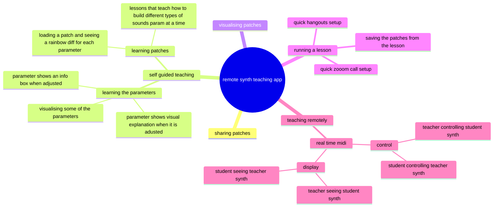

# Synth Stage
This project's purpose is simple: to transform the way we learn to use synthesizers. Specifically, the Korg Monologue. This is not just another MIDI controller project. It's a virtual classroom focused on teaching beginners how to make the most of their first real, physical synthesizer.

## Expected Outcomes
* MIDI Connection: Connect the Korg Monologue to the web app successfully to interpret MIDI signals.

* Parameter Display: Develop an intuitive and clear display of the synthesizer's parameters for easy understanding.

* Real-Time Learning: The student can see teachers parameters overlaid upon thier own display and vice versa.

* Patch Management: Implement the ability to create, save, upload, and download patches, fostering a library of sounds for students to explore and learn from.

In essence, this project is about building a "Minority Report" style HUD that enhances the monologue and allows for two way communication.

