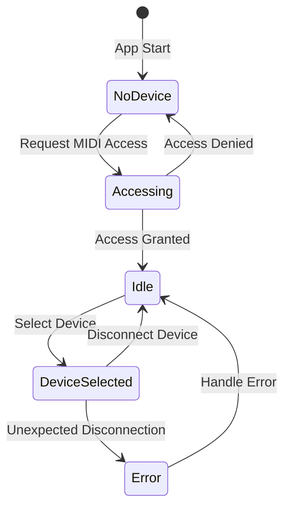
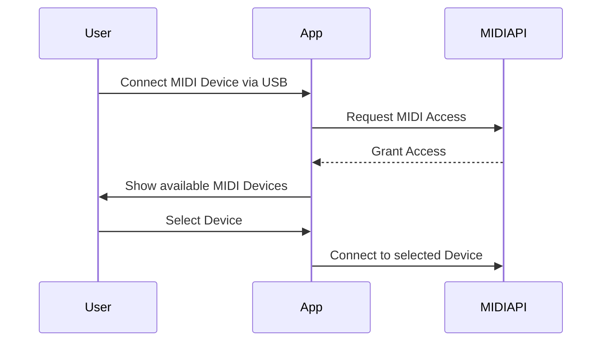
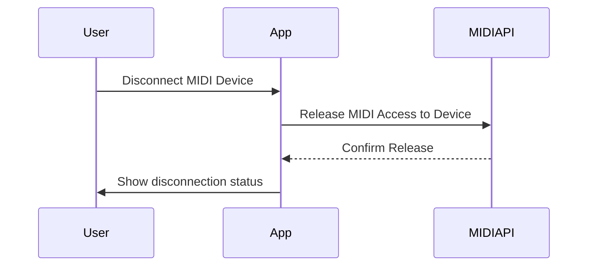

# State machine for connection management

```mermaid
stateDiagram-v2
[*] --> NoDevice : App Start
NoDevice --> Accessing : Request MIDI Access
Accessing --> NoDevice : Access Denied
Accessing --> Idle : Access Granted
Idle --> DeviceSelected : Select Device
DeviceSelected --> Idle : Disconnect Device
DeviceSelected --> Error : Unexpected Disconnection
Error --> Idle : Handle Error
```

# Sequence for connecting

```mermaid
sequenceDiagram
  participant User
  participant App
  participant MIDIAPI
  User->>App: Connect MIDI Device via USB
  App->>MIDIAPI: Request MIDI Access
  MIDIAPI-->>App: Grant Access
  App->>User: Show available MIDI Devices
  User->>App: Select Device
  App->>MIDIAPI: Connect to selected Device

```
# Sequence for disconnecting

```mermaid
sequenceDiagram
  participant User
  participant App
  participant MIDIAPI
  User->>App: Disconnect MIDI Device
  App->>MIDIAPI: Release MIDI Access to Device
  MIDIAPI-->>App: Confirm Release
  App->>User: Show disconnection status
```