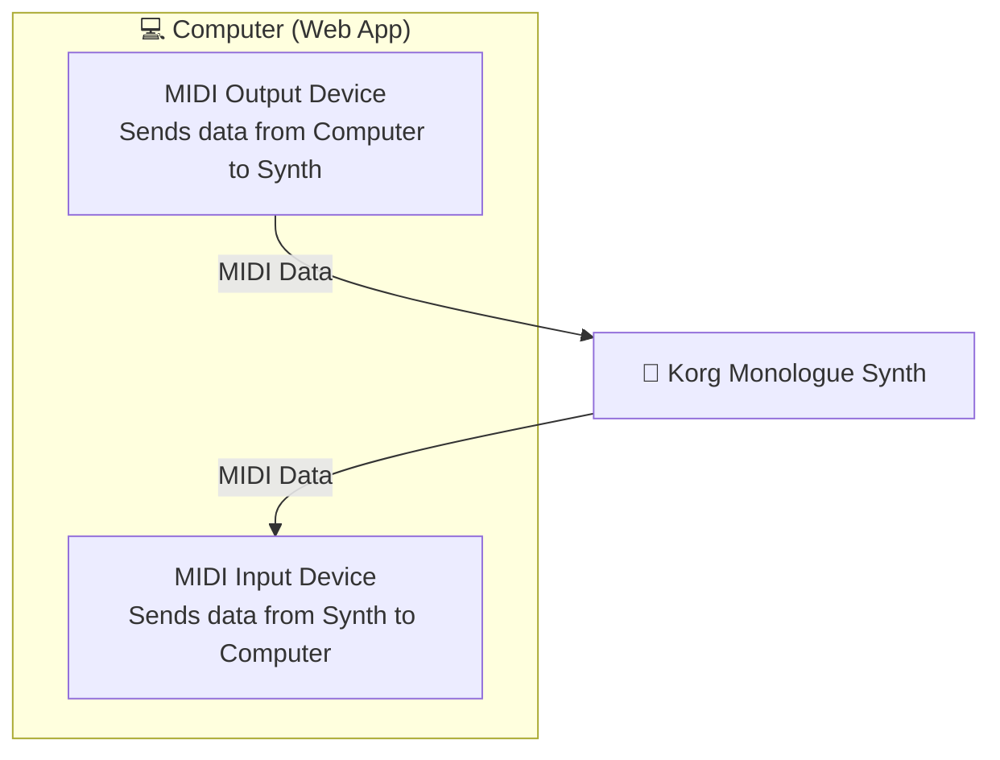

```mermaid
graph TB
    subgraph "💻 Computer (Web App)"
    A["MIDI Input Device\nSends data from Synth to Computer"]
    B["MIDI Output Device\nSends data from Computer to Synth"]
    end
    D["🎹 Korg Monologue Synth"] -- "MIDI Data" --> A
    B -- "MIDI Data" --> D
```